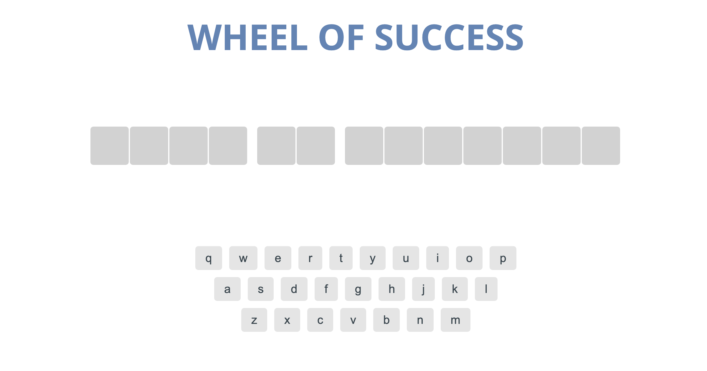

# JavaScript Wheel of Success Game

A browser-based word guessing game developed as part of the Team Treehouse Techdegree program. Players attempt to guess a hidden phrase by selecting letters, with a limited number of incorrect guesses allowed.

[View Live Project](https://heidifryzell.com/wheel-of-success/)



## Features

- **Interactive Gameplay**: Engaging user interface with dynamic feedback.
- **Keyboard Support**: Players can use both mouse clicks and keyboard input to select letters.
- **Responsive Design**: Optimized for various screen sizes and devices.

## Installation

1. **Clone the Repository**:
   ```bash
   git clone https://github.com/heidi37/wheel-of-success.git
   cd wheel-of-success
   ```

2. **Open in Browser**:
   - Simply open `index.html` in your preferred web browser to start the game.

## How to Play

1. **Start the Game**: Launch the game by opening `index.html`.
2. **Guess the Phrase**: Click on letters or use your keyboard to guess the hidden phrase.
3. **Win or Lose**: The game ends when you either guess the entire phrase correctly or exhaust all allowed incorrect guesses.

## Technologies Used

- **JavaScript**: Core game logic and interactivity.
- **HTML5**: Structure of the game interface.
- **CSS3**: Styling and layout.

  

## Project Structure

- `index.html`: Main HTML file.
- `app.js`: Contains the game logic.
- `styles.css`: Styling for the game interface.
- `images/`: Directory containing image assets.

## Future Improvements

- move the phrases array to server-side code so users can't see it with the developer tools
- limit the number of guesses a user can make
- let them guess the word before filling in all the letters, add a "guess now" field
- tally a score of successful guesses

## Acknowledgments

This project was developed as part of the Team Treehouse Techdegree program. Special thanks to the Treehouse community and instructors for their guidance and support.

---

Feel free to customize this template to better fit your project's specifics or to highlight any additional features and acknowledgments. 

## Related Projects

<table border="1">
  <tr>
    <td style="text-align: center;"><a href="https://heidifryzell.com">My Portfolio</a> | <a href="https://github.com/heidi37/my-python-portfolio">Repo</a></td>
  </tr>
  <tr>
    <td><a href="https://heidifryzell.com"></a></td>
  </tr>
</table>
